# Decrypt all E2E room messages in RocketChat

## Prerequirements

- install Rust
- clone this repository

```
cargo install just
cargo install hurl
```

## How to use

- store your private RSA-key in private_rsa_key.pem
- store room session key encrypted by your public RSA-key and encoded in base64uri in session_encoded.key
- change placeholders in justfile to your auth credentials
- run `just get-config-from-template`
- run `just get-e2e-room-messages`
- run `just decode-e2e-room-messages`

## Demo


